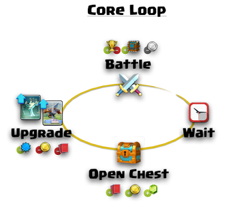
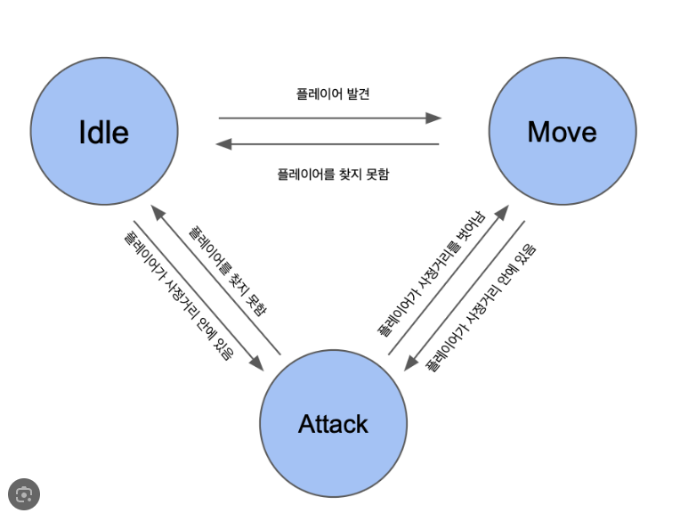

# 📆 2025-05-27 TIL : 기획 커리큘럼 W2D8 – 시스템 기획 입문

---

## 📝 배운 내용 및 개념

### 🎮 시스템 기획의 정의
- 게임의 규칙과 요구사항을 정의하여 **플레이 가능한 형태로 설계**하는 작업
- 기술 구현은 프로그래머가 담당하고, 시스템 기획자는 **게임 내 규칙과 흐름을 명확히 규정**
- `GDD (Game Design Document)` 초기 단계에서의 핵심 역할
- **코어 루프**를 기반으로 기능 단위로 세분화하여 FSM, 예외 처리, 인터페이스 등을 정의함

---

### 📊 데이터 테이블 기초 개념

> 게임 시스템을 효율적으로 관리하기 위해 데이터 기반 설계가 필요함

- **필드(Field)**: 속성 이름 (예: HP, Cost 등)
- **레코드(Record)**: 하나의 항목에 대한 정보 묶음
- **PK (Primary Key)**: 고유 식별자

#### 데이터 테이블 작성 시 규칙
1. 셀에는 **하나의 데이터만 입력**
2. **PK는 중복 없이** 유일해야 함
3. **하나의 테이블에는 하나의 주제만** 다룰 것

---

### 📈 스프레드시트 사용 이유

- **엑셀/스프레드시트는 시스템 기획의 핵심 도구**
- 대량 데이터를 정리하고 **함수로 계산 가능**
- 기획자에게 필수적인 함수들:
  - `SUM`, `IF`, `VLOOKUP`, `ROUND`, `COUNT`, `AVERAGE` 등

---

### 🤖 FSM(Finite State Machine) 개념

> 시스템 또는 캐릭터가 하나의 상태만 가질 수 있고, 특정 조건에서만 다른 상태로 전이됨

- 예: `Idle → Chase → Attack → Flee → Dead`
- 각 상태 간 전이 조건을 도식화하여 **구조적으로 설계 가능**

---

## 💡 시도해본 것

- **주민등록번호 예제를 통해** 데이터 테이블을 구성하며 `필드-레코드` 개념 체화
- FSM 상태 흐름을 **텍스트 도식으로 직접 그려보며** 개념 정리 시도

<pre>
[Idle]
  └─(플레이어 감지)→ [Chase]
      └─(사거리 진입)→ [Attack]
          └─(체력↓)→ [Flee]
              ├─(회복↑)→ [Chase]
              └─(체력 0)→ [Dead]
          └─(플레이어 죽음)→ [Idle]
      └─(플레이어 놓침)→ [Idle]
</pre>

---

## 🧠 알게 된 것

- 시스템 기획자는 단순 설계자가 아닌 **전체 게임 메커니즘의 책임자**
- 내가 정의한 룰 하나가 **게임 밸런스, UX, 매출**에까지 영향을 미칠 수 있음
- **데이터 기반 사고와 스프레드시트 정리 능력**은 기획자 업무의 핵심 도구이며, 미리 숙련될 필요가 있음

---

